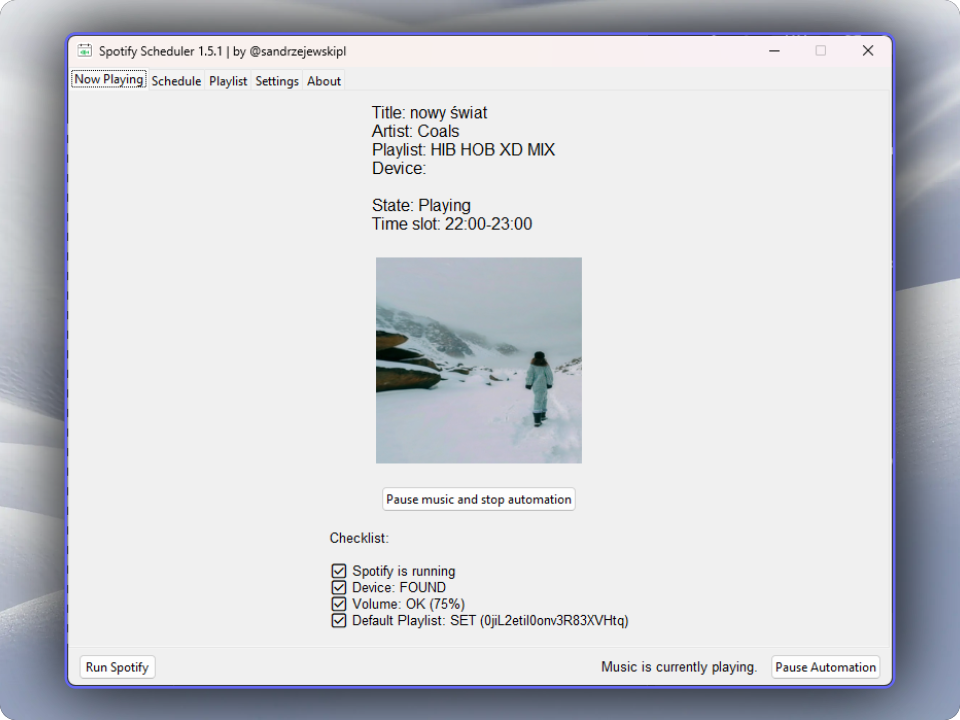
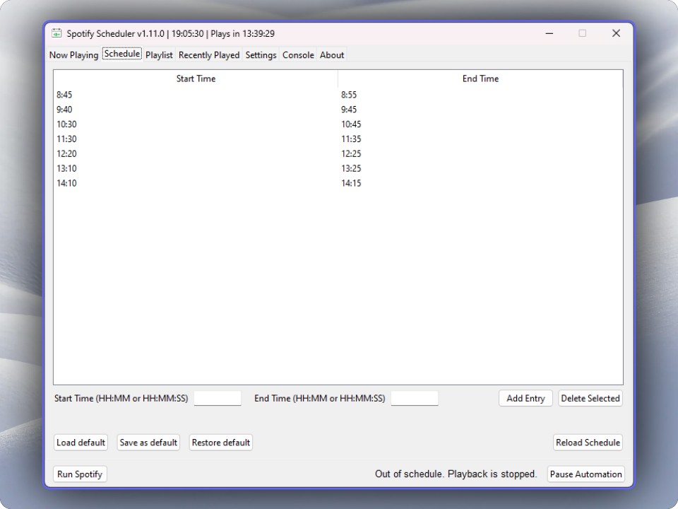
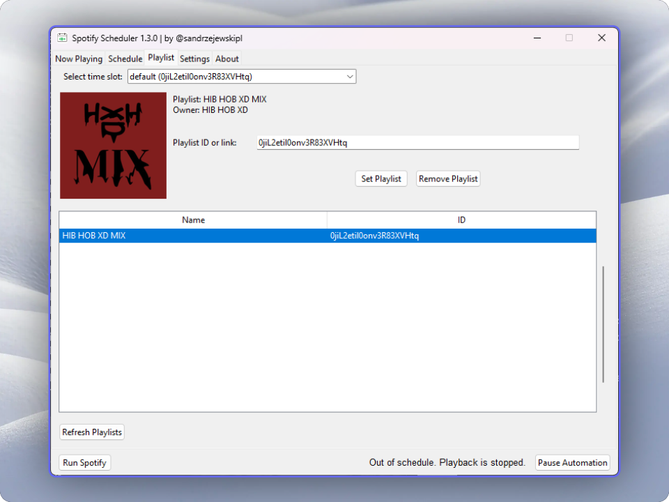
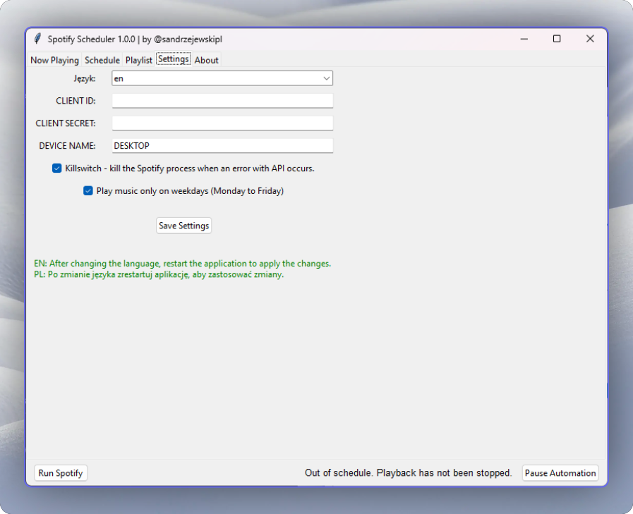

<head>
<meta name="google-site-verification" content="f2Z2Pj-uax87F1Ydp1TJX5dMwfDj4ZCW7XLGCKD0Xrk" />
</head>

# <a href="https://github.com/sandrzejewskipl/spotify-scheduler">Spotify Scheduler</a>
This Python GUI application lets you schedule Spotify playlists to play at specific hours and minutes (e.g., 8:00-8:15). Use it to automate your listening experience and customize playback times according to your preferences.

Easily plan and schedule music for any time of day! Modify your schedule, choose a playlist from the user's playlist library, or directly add a playlist using its ID or link. Perfect for managing music playback effortlessly, whether you're creating a radio station for your school to play music during breaks or events, setting up a music schedule for your workplace, or planning playlists for specific times at venues.

### Scheduling playlists
On Playlist tab you can schedule playlist for certain time. If no time is selected, it refers to default.

## Running on Windows
<b>Set up Spotify App:</b>

- Go to https://developer.spotify.com/dashboard and create a new app. 
- Set the Redirect URI to: `http://localhost:23918`. 
- Select Web API and Web Playback SDK. 

Download an `.exe` file from the latest release <a href="https://github.com/sandrzejewskipl/spotify-scheduler/releases">here</a> and launch it.

A `spotify-scheduler_data` folder will be automatically created. This folder contains configuration files and needs to remain in the same directory as your .exe.

On the first run, you will be asked for CLIENT_ID and CLIENT_SECRET from Spotify in a console. Then OAuth popup should open. You <b>need</b> to keep the console running; otherwise, closing it will cause the program to stop.
## Running on Linux and MacOS (or Windows without using .exe)
<b>Clone the repository (by the command below, or download it)</b>

`git clone https://github.com/sandrzejewskipl/spotify-scheduler.git` 

<b>Install dependencies:</b> 
Make sure you have <b>Python 3</b> installed. Then, download the required packages by running:

`pip install -r requirements.txt` 

Make sure you have <b>Python3-tk</b> installed.

- Linux: `sudo apt-get install python3-tk`

- MacOS: `brew install python-tk`

<b>Set up Spotify App:</b>

- Go to https://developer.spotify.com/dashboard and create a new app. 
- Set the Redirect URI to: `http://localhost:23918`. 
- Select Web API and Web Playback SDK. 

Run this command from the command line in the same directory.

`python3 main.py`

On the first run, you will be asked for CLIENT_ID and CLIENT_SECRET from Spotify. Then OAuth popup should open.

## Settings

You can fully configure your settings and set your schedule using the GUI. If you are unable to display the GUI, you can customize the files in the `spotify-scheduler_data` folder and restart the app to apply the changes.

### Supported languages:
- English (en)
- Polish (pl)

<b>DEVICE NAME</b> - name (or part of it) of the device in Spotify API that will play music. You can find the device name in the bottom-left corner or check the list of devices in the Settings tab. It defaults to host name.

<b>Play music only on weekdays</b> - Music will only be played from Monday to Friday.

<b>Killswitch</b> - feature that kills the Spotify process(es) when an error with API occurs when pausing the playback. It prevents playing music out of schedule. (only on Windows)

<b>Auto-lunch spotify</b> - feature that automatically launches Spotify if the device is not detected on the devices list. (only on Windows)

## After changing the language, run the script again.
