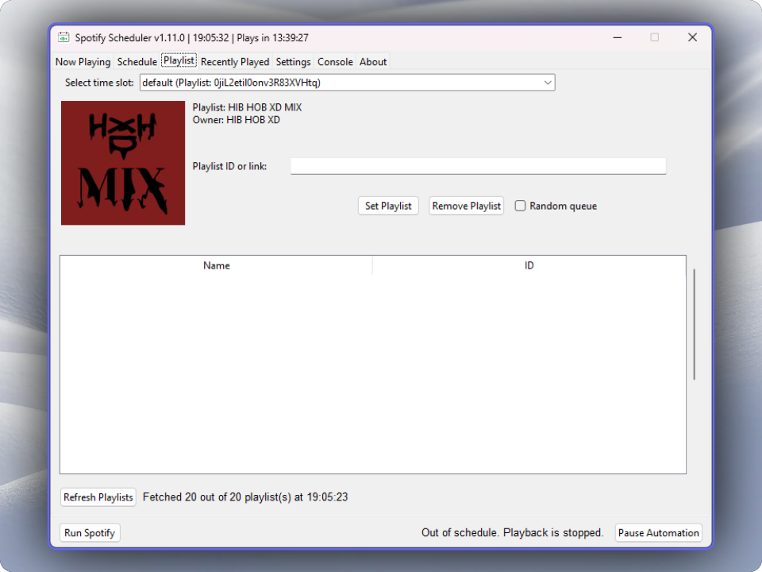
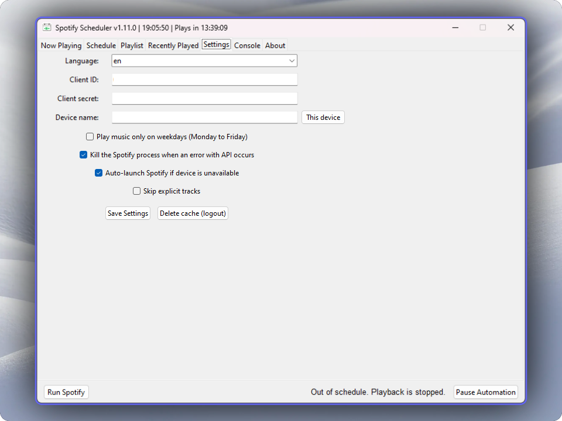

# Spotify Scheduler
This Python script application with GUI allows you to schedule a Spotify playlist to play at specific times (e.g. 8:00-8:15).

You can modify schedule, select playlist from user's playlist list or manually put ID or link to it.

## Installation
<b>Clone the repository (by the command below, or download it)</b>

`git clone https://github.com/sandrzejewskipl/spotify-scheduler.git` 

<b>Install dependencies:</b> 
Make sure you have Python installed. Then, download the required packages by running:

`pip install -r requirements.txt` 

<b>Set up Spotify App:</b>

- Go to https://developer.spotify.com/dashboard and create a new app. 
- Set the Redirect URI to: `http://localhost:8080`. 
- Select Web API and Web Playback SDK. 

## Run
Run this command from the command line in the same directory. 
`python main.py`

On the first run, you will be asked for CLIENT_ID and CLIENT_SECRET from Spotify. Then OAuth popup should open.

## Settings tab

### Supported languages:
- Polish (pl)
- English (en)

<b>Killswitch</b> - feature that kills the Spotify process(es) when an error with API occurs. It prevents playback when it shouldn't be played but API call somehow didn't worked.

<b>Play music only on weekdays</b> - You can play music only on Monday to Friday

## After changing the language, run the script again.
