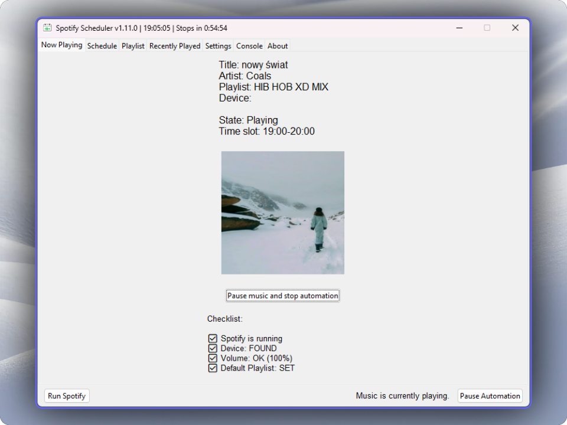

<h1 align="center"><a href="https://github.com/sandrzejewskipl/spotify-scheduler">Spotify Scheduler</a>  Automate and schedule your Spotify playback</h1>

This Python GUI application lets you schedule Spotify playlists to play at specific hours, minutes and seconds (e.g. 8:00-8:15:30). Easily automate your Spotify playback to match your schedule and listening preferences with precision. You can select a different playlist for each time slot. It's a much easier alternative to music automation softwares. Spotify Scheduler also features a history of recently played songs.

Easily plan and schedule music for any time of day! Modify your schedule, choose a playlist from the user's playlist library, or directly add a playlist using its ID or link. Perfect for managing music playback effortlessly, whether you're creating a radio station for your school to play music during breaks or events, setting up a music schedule for your workplace, or planning playlists for specific times at venues.

### Scheduling playlists
In the Playlist tab, you can assign playlists to specific time slots. If no playlist is assigned to a slot, the default playlist will be used.

You can also turn on <b>Random queue</b> for specific playlist. It's an alternative to Spotify's shuffle (which is not really random). When starting playback, app will create a temporary playlist with random tracks from your playlist. <b>Random queue doesn't support local tracks!</b> 
<h3>If you're using <b>Random queue</b>, disable shuffle option in your Spotify client.</h3>

### Recently played
In the Recently played tab, you can see your playback history.

> [!IMPORTANT]
> Make sure you got Spotify Premium subscription and are using Spotify's desktop app - not web version!

## Running on Windows
<b>Set up Spotify App:</b>

- Go to [Spotify for Developers Dashboard](https://developer.spotify.com/dashboard) and create a new app. 
- Set the Redirect URI to: `http://127.0.0.1:23918`. 
- Select Web API 

Download an `.exe` file from the latest release <a href="https://github.com/sandrzejewskipl/spotify-scheduler/releases">here</a> and launch it.

On the first run, you will be asked for CLIENT_ID and CLIENT_SECRET from Spotify. Then OAuth popup should open.

## Running on Linux
<b>Clone the repository (by the command below, or download it)</b>

`git clone https://github.com/sandrzejewskipl/spotify-scheduler.git`

Inside Spotify Scheduler's directory run this command:

`chmod +x run.sh`

Now, you can run this app by running:

`./run.sh`

This script will take care of making sure that Python3 and dependencies are installed.

On the first run, you will be asked for CLIENT_ID and CLIENT_SECRET from Spotify. Then OAuth popup should open.
## Running script manually
<b>Clone the repository (by the command below, or download it)</b>

`git clone https://github.com/sandrzejewskipl/spotify-scheduler.git`

<b>Install dependencies:</b> 
Make sure you have <b>Python 3</b> installed. Then, download the required packages by running:

`pip3 install -r requirements.txt` 

Make sure you have <b>Python3-tk</b> installed.

- Linux: `sudo apt-get install python3-tk`

- MacOS: `brew install python-tk`

<b>Set up Spotify App:</b>

- Go to [Spotify for Developers Dashboard](https://developer.spotify.com/dashboard) and create a new app. 
- Set the Redirect URI to: `http://127.0.0.1:23918`. 
- Select Web API 

Run this command from the command line in the same directory.

`python3 spotifyscheduler.py`

On the first run, you will be asked for CLIENT_ID and CLIENT_SECRET from Spotify. Then OAuth popup should open.

If you're running script manually on Windows and you're using cmd.exe (not Windows Terminal) remember to disable Quickedit to prevent program from freezing:
- Right-click the title bar of the Command Prompt window.
- Select “Properties” from the context menu.
- In the Properties window, click on the “Options” tab.
- Under the "Edit Options" section, uncheck the box that says "QuickEdit Mode."
Click "OK" to save your changes.

## Settings

### Supported languages:
- English (en)
- Polish (pl)
### After changing the language, run the script again.

<b>DEVICE NAME</b> - name (or part of it) of the device in Spotify API that will play music. You can find the device name in the bottom-left corner or check the list of devices in the Settings tab. It defaults to host name.

<b>Play music only on weekdays</b> - Music will only be played from Monday to Friday. <b>Default: </b>Off

<b>Kill the spotify process</b> - feature that kills the Spotify process(es) when an error with API occurs when pausing the playback. It prevents playing music out of schedule. <b>Default: </b>On

<b>Auto-launch Spotify</b> - feature that automatically launches Spotify if the device is not detected on the devices list. <b>Default: </b>On

For optimal stability and reliable playback automation, it's recommended to enable both the Kill and Auto-launch Spotify features.
### After changing CLIENT_ID or CLIENT_SECRET or wanting to change Spotify account (do it by logging in to another account in the browser), click `Delete cache (logout)` button.

App data files (config, schedules, playlists, logs and spotify token) are stored inside user's data directory:

Windows: `%localappdata%\spotify-scheduler`

Linux: `~/.local/share/spotify-scheduler`

MacOS: `~/Library/Application Support/spotify-scheduler`

<h1 align="center"><a href="https://github.com/sandrzejewskipl/spotify-scheduler/releases/latest">Download latest release</a> | <a href="https://github.com/sandrzejewskipl/spotify-scheduler/blob/main/CHANGELOG.md">Changelog</a></h1>
